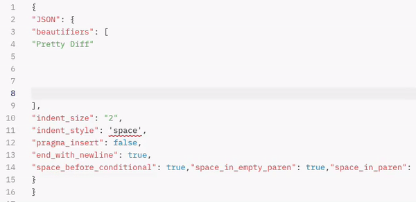

<h1 align="center">
  <br>
  <a href="https://unibeautify.com/">
    
  </a>
  <br>
  <b>✨ Unibeautify ✨</b>
  <br>
</h1>

<h4 align="center">One Beautifier to rule them all, One Beautifier to clean them, One Beautifier to bring them all and in the darkness sheen them</h4>

<p align="center">
  <a href="https://renovateapp.com/">
    
  </a>
  <a href="https://codeclimate.com/github/Unibeautify/unibeautify/maintainability">
    
  </a>
  <a href="https://codeclimate.com/github/Unibeautify/unibeautify/test_coverage">
    
  </a>
  <a href="https://travis-ci.com/Unibeautify/unibeautify">
    
  </a>
  <a href="https://ci.appveyor.com/project/Glavin001/unibeautify/branch/master">
    
  </a>
</p>

<p align="center">
  <a href="#introduction">Introduction</a> •
  <a href="#features">Features</a> •
  <a href="#installation">Installation</a> •
  <a href="#how-to-use">How To Use</a> •
  <a href="#feedback">Feedback</a> •
  <a href="#contributing">Contributing</a>
</p>

<p align="center">
  
</p>

## Introduction

We all love to code, that is why we are here – on the earth, no(!) on GitHub –
so this tool will make coding even more fun and will improve your work with
co-workers, friends and the world of coding!

Unibeautify formats your code on-the-fly and supports
[many languages](https://unibeautify.com/docs/languages) with plenty of options
so you can customize to meet your needs. You can be confident everyone who is
editing your code will leave it looking beautiful!

To fund the continued growth and development, Unibeautify will have paid
features like the Unibeautify-CI. But feel free to buy us a coffee or support us
on Patreon. <- what about that @glavin?

Unibeautify will have paid features like the Unibeautify-CI to fund the
continued growth and development.

## Features

* Single beautifier abstracting multiple beautifiers for
  [multiple languages](https://unibeautify.com/docs/languages)
* Unified beautifier
  [configuration options](https://unibeautify.com/docs/config-file)
* Automated beautification with
  [Unibeautify CI](https://unibeautify.com/docs/ci)
* Easy to set up with NPM
* Simple usage
* The old way through the [console window](#command-line-interface-cli)

## Installation

The installation for Unibeautify is super simple, just install it via the
[Node Package Manager (NPM)](https://www.npmjs.com/):

```shell
$ npm install --save-dev unibeautify
```

or with [Yarn](https://yarnpkg.com/):

```shell
$ yarn add --dev unibeautify
```

### Command-line interface (CLI)

Unibeautify can also be run through a terminal of your choice with the
Command-line interface (CLI). Unibeautify CLI is an awesome tool if you love to
code and often use the Terminal to do things. To learn more about the
Unibeautify CLI go to:
[https://github.com/Unibeautify/unibeautify-cli](https://github.com/Unibeautify/unibeautify-cli)

> :warning: **Important:** We do not recommend using Unibeautify CLI with your
> Continuous Integration (CI) service, such as Travis CI. Instead, you should
> consider using Unibeautify CI which is a more optimized solution.

## How to use

To learn more about Unibeautify and how to use it, just have a look in our well
commented [examples](examples/).

> You need a little bit of experience in [Node.js](https://nodejs.org/en/about/)

## Feedback

We love to stay in touch with our users and are interested in their opinion. It
is so important to have an ear for user feedback. Please feel free to contact us
through [Twitter](https://twitter.com/Unibeautify),
[StackOverlow](https://stackoverflow.com/questions/tagged/unibeautify) or the
[issue panel](https://github.com/unibeautify/unibeautify/issues) for feedback,
feature requests or improvements!

## Contributing

Thank you for helping us make this project even more awesome! To get involved
you need to [clone](https://git-scm.com/docs/git-clone) this repository first
and install its dependencies. To do that, simply run:

```shell
$ git clone https://github.com/Unibeautify/unibeautify.git
$ npm install
```

Now take some time studying our code and look into the
[issue and feature requests](https://github.com/unibeautify/unibeautify/issues)
users submitted through the issuing panel. Maybe there is something you want to
fix or improve for us?

While you are developing to make this project even better, you can test and
build your code. This is a must, so we don't need to make this for you and you
will be more close to getting a pull request approved.

Simply run this command to test or run. You can also run the dev command to
watch for your changes.

```shell
$ npm run build # or
$ npm run dev # to watch for your changes
$ npm test # then do some testing
```

After you have developed something awesome, you have to lint your code, so we
can be sure it is also looking beautiful. Simply run this command to lint your
code:

```shell
$ npm run lint
```
